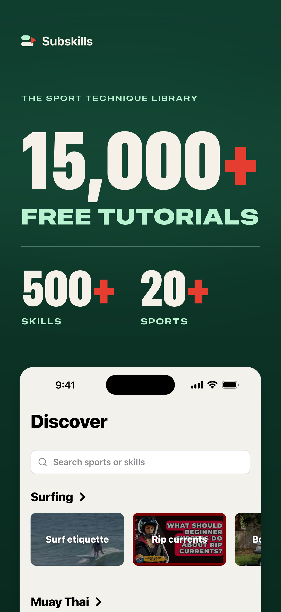
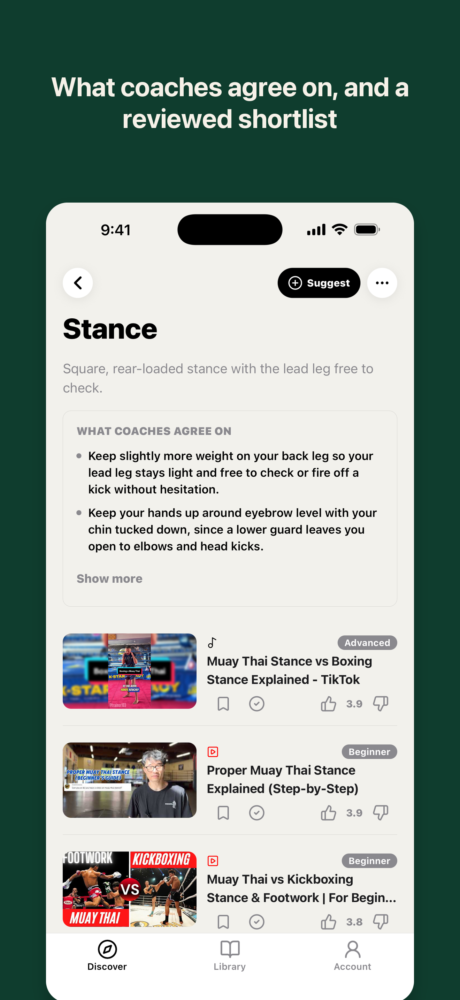
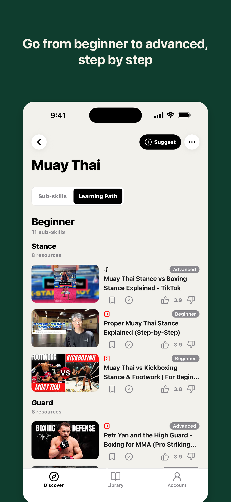

# Subskills

Free sports technique tutorials, sorted by sub-skill.

**[subskills.xyz](https://subskills.xyz)** · **[iOS app](https://apps.apple.com/app/id6810049311)**

<p>
  
  
  
</p>

Tutorial collections are usually organized by channel or playlist. Subskills breaks each sport into the techniques you actually practice, like the backhand clear in badminton or the back-rank mate in chess, and gathers the best videos for each one from YouTube, TikTok and Instagram.

- 22 sports split into 554 sub-skills, with a learning path for each sport
- Every video is reviewed before it's published, and gets a level tag and short notes on what it covers
- Browsing needs no account. An optional one keeps a watch-later list and tracks what you've watched

## What's in this repository

The code for the website and the iOS app:

| Path | What it is |
|---|---|
| `apps/web` | The website: Next.js (App Router), hosted on Netlify behind Cloudflare |
| `apps/mobile` | The iOS app: Expo and React Native |
| `packages/shared` | Types and helpers used by both |
| `supabase/migrations`, `supabase/tests` | The Postgres schema, its row-level security and tests |

The catalog itself (which videos appear on which page, with their levels and notes) is built by a separate data pipeline. Neither the pipeline nor the catalog is part of this repository.

## Running it locally

You need Node 20 and npm 10.

```bash
npm ci
npm run dev:web
```

With no environment variables set, the website runs on a small built-in demo catalog at http://localhost:3000. To use a Supabase project instead, copy the website variables from `.env.example` into `apps/web/.env.local`. The schema is in `supabase/migrations`.

For the iOS app, copy the `EXPO_PUBLIC_` variables from `.env.example` into `apps/mobile/.env`, then:

```bash
npm run dev:mobile
```

Checks: `npm run lint`, `npm run typecheck`, `npm run test`, and `npm run test:e2e:web` for the browser tests.

## Contributing

Issues and pull requests are welcome. See [CONTRIBUTING.md](CONTRIBUTING.md).

## License

The code is licensed under the [GNU Affero General Public License v3.0](LICENSE). If you run a modified version as a service for other people, you have to publish your changes under the same license.

The Subskills name, logo and app icons, and the screenshots in `store-assets/`, are not covered by the license.

Copyright (c) 2026 Sergii Knyr
